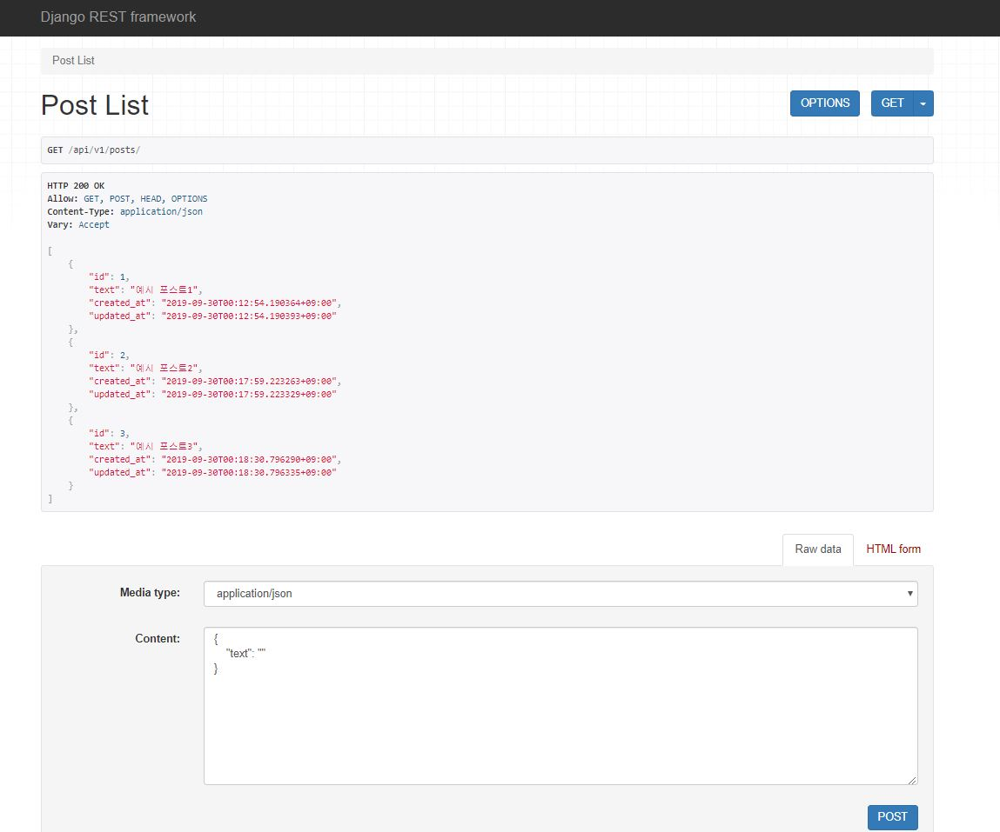

# Django Rest Framework 과제

## 유의사항
- 이미 있는 db.sqlite3에 예시 데이터가 들어있으므로 DB는 변경하지 않고 사용하도록 합니다.
- [django 공식 도큐먼트](https://docs.djangoproject.com/ko/2.2/)와 [drf 공식 도큐먼트](https://www.django-rest-framework.org/)를 참조해서 주어진 api를 구현하시면 됩니다.

## 구현 스펙
**1. 모든 'Post'의 list를 가져오는 API**
- url: `api/v1/posts/`
- method: `GET`
    
 
    결과 예시)
    ```
    [
        {
            "id": 1,
            "comment": [
                1,
                2,
                3
            ],
            "text": "예시 포스트1",
            "likes_count": 123,
            "created_at": "2019-09-30T00:12:54.190364+09:00",
            "updated_at": "2019-09-30T00:12:54.190393+09:00"
        },
        {
            "id": 2,
            "comment": [
                4,
                5
            ],
            "text": "예시 포스트2",
            "likes_count": 22,
            "created_at": "2019-09-30T00:17:59.223263+09:00",
            "updated_at": "2019-09-30T00:17:59.223329+09:00"
        },
        {
            "id": 3,
            "comment": [
                6,
                7
            ],
            "text": "예시 포스트3",
            "likes_count": 54,
            "created_at": "2019-09-30T00:18:30.796290+09:00",
            "updated_at": "2019-09-30T00:18:30.796335+09:00"
        }
    ]
    ``` 

**2. 새로운 'Post'를 create 하도록 요청하는 API**
- text 값을 담아 보내면 해당 값을 text field에 저장하고 있는 Post 생성
    - url: `api/v1/posts/`
    - method: `POST`
    - body: `{"text": "새로운 post"}`
    
    

## Tip
https://www.django-rest-framework.org/api-guide/generic-views/ \
https://www.django-rest-framework.org/api-guide/serializers/ 

<br>
-------
<br>

# WHAT I LEARNED


## REST API
- REpresentational State Transfer API
- DRF == Django REST Framework

<br>

## Serializer
- Serializer는 쿼리 셋, 모델 인스턴스 등의 데이터를 파이썬 데이터로 변환해준다. 이를 통해 JSON이나 XML 등의 관련 객체로의 랜더링이 가능해진다.
- 보통 `serializers.py`의 파일을 새로 만들고, 그 안에 `from rest_framework import serializer`를 통해 받은 `ModelSerializer` 클래스를 상속받아 모델 별 새로운 serializer 클래스를 만든다.
- `ModelForm`을 만들 때와 마찬가지로 `Model`에서 `fields`를 가져와 해당 serializer 클래스에서 사용한다. 마찬가지로 `exclude` 프로퍼티도 사용 가능하다.
    ```
    class PostSerializer(serializers.ModelSerializer):
    class Meta:
        model = Post
        exclude = ('likes_count', )
    ```
    ```
    class PostSerializer(serializers.ModelSerializer):
    class Meta:
        model = Post
        fields = '__all__'
    ``` 

<br>

## GenericViewAPI
- 말 그대로 `GenericView`에 대한 API이다. `ListView`, `CreateView` 등과 같은 CBV를 `py manage.py runserver`를 통해 접속한 웹페이지에서 확인 가능하다.
        
- `views.py`에 `GenericViewAPI` 클래스를 받아와 상속받고 관련 프로퍼티 값을 수정해서 손쉽게 `GenericViewAPI` 구현 가능
    ```
    class PostList(generics.ListCreateAPIView):
        queryset = Post.objects.all()
        serializer_class = PostSerializer
    ```
- 해당 CBV에서 `serializer_classes`라는 프로퍼티에 `serializer.py`에서 구현한 serializer 클래스를 대입해주면 해당 serializer를 사용할 수 있다.
- 해당 cbv를 이용해서 `as_view()` 메소드를 사용해 url 패턴과 매핑하는 것 말고도, `urls.py`에서 직접 GenericView API를 불러온 뒤, 파라미터를 직접 입력해 바로 사용할 수도 있다.
    ```
    urlpatterns = [
        path('posts/', ListCreateAPIView.as_view(queryset=Post.objects.all(), serializer_class=PostSerializer), name='post-list'),  
    ]
    ```
    ```
    urlpatterns = [
        path('posts/', PostList.as_view(), name='post-list'),
    ]
    ``` 


